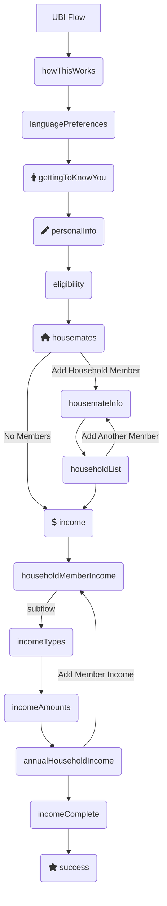

# Form Flow Starter Application

Table of Contents
=================
<!--
    **  This is not automatically generated. **
    Update this section when you update sections now.
    Please don't go more than three layers deep, so we can keep the TOC
    a reasonable size.
-->

* [Form Flow Starter Application](#form-flow-starter-application)
* [Table of Contents](#table-of-contents)
* [Universal Basic Income (UBI) Form Flow](#universal-basic-income-ubi-form-flow)
    * [Static Pages](#static-pages)
* [Development setup](#development-setup)
    * [System dependencies](#system-dependencies)
        * [Java Development Kit](#java-development-kit)
        * [Set up jenv to manage your jdk versions](#set-up-jenv-to-manage-your-jdk-versions)
        * [Gradle](#gradle)
        * [Start the local databases](#start-the-local-databases)
        * [Setup Environment](#setup-environment)
        * [Setup Application](#setup-application)
        * [Contributing Live Templates to your App](#contributing-live-templates-to-your-app)
        * [Using a local version of the Form-Flow Library (For Form-Flow Library Developers)](#using-a-local-version-of-the-form-flow-library-for-form-flow-library-developers)
* [Using this as a template repository](#using-this-as-a-template-repository)
        

This is a standard Spring Boot application that uses the `form-flows` Java package as a library. It
can be customized to meet the needs of a web app, and is meant to be built upon. It's a plain,
boring (but modern) Spring app that uses common, frequently-used libraries throughout.

It contains example code for a simple, generic application for public benefits. An applicant
can fill out screens with their basic info, upload supporting documents, then submit it all.
Upon submission, they receive a simple SMS confirmation and a receipt email with a filled-in
application PDF. The entire experience is in both English and Spanish.

To power the form flow logic, this app depends on the `form-flows` Java library. That library is
included in `build.gradle` along with all other dependencies. The codebase for the `form-flows`
package is [open source](https://github.com/codeforamerica/form-flow).

A detailed explanation of form flow concepts can be found on in
the [form flow library's readme](https://github.com/codeforamerica/form-flow).

# Universal Basic Income (UBI) Form Flow

This chart below shows the flow created by the `flows-config.yaml` file in this repository.



## Static Pages

Unlike Screens, Static Pages are HTML content and are not part of a flow. Detailed information
about static pages can be found in
the [form-flow library documentation.](https://github.com/codeforamerica/form-flow#static-pages)

This application has three static pages served up by
the [StaticPageController](src/main/java/org/formflowstartertemplate/app/StaticPageController.java)
class:

* [index.html](src/main/resources/templates/index.hmtl)
* [faq.html](src/main/resources/templates/faq.html)
* [privacy.html](src/main/resources/templates/privacy.html)

# Setup instructions

## System dependencies

_Note: these instructions are specific to macOS, but the same dependencies do need to be installed
on Windows as well._

### Java Development Kit

If you do not already have Java 17 installed, we recommend doing this:

```
brew tap homebrew/cask-versions
brew install --cask temurin17
```

### Set up jenv to manage your jdk versions

First run `brew install jenv`.

Add the following to your `~/.bashrc` or `~/.zshrc`:

```
export PATH="$HOME/.jenv/bin:$PATH"
eval "$(jenv init -)"
```

For m1 macs, if the above snippet doesn't work, try:

```
export PATH="$HOME/.jenv/bin:$PATH"
export JENV_ROOT="/opt/homebrew/Cellar/jenv/"
eval "$(/opt/homebrew/bin/brew shellenv)"
eval "$(jenv init -)"
```

Reload your terminal, then finally run this from the repo's root directory:

```
jenv add /Library/Java/JavaVirtualMachines/temurin-17.jdk/Contents/Home
```

### Gradle

`brew install gradle`

### Start the local databases

- Install PostgreSQL 14 via an [official download](https://www.postgresql.org/download/)
    - Or on macOS, through homebrew: `brew install postgresql@14`

<!-- TODO: Is this the right way to create db/user? -->

- Create the database using the command line:
    - `$ createdb starter-app`
    - `$ createuser -s starter-app`

### Setup Environment

Note that you'll need to provide some environment variables specified in [sample.env](sample.env) to your IDE/shell to run the application. We use IntelliJ and have provided setup instructions for convenience.

#### IntelliJ
- `cp sample.env .env` (.env is marked as ignored by git)
- Download the [EnvFile plugin](https://plugins.jetbrains.com/plugin/7861-envfile) and follow the setup instructions[here](https://github.com/Ashald/EnvFile#usage) to setup Run
  Configurations with EnvFile.

### Setup Application

- Use instructions from
  the [form-flow library here.](https://github.com/codeforamerica/form-flow#intellij-setup)
- Run the application using the `StarterApplication` configuration (found
  in `org.formflowstartertemplate.app`)

### Contributing Live Templates to your App

If you have created live templates with fragments which are specific to your application based on a starter app template, 
you can commit them to your repository. You will follow a similar pattern to create templates to what is
outlined [in the form-flow library here.](https://github.com/codeforamerica/form-flow#contribute-new-live-templates)

An example template which was set up using this process, starting from an html snippet is available 
[in this repository's IntelliJ settings folder](intellij-settings/StarterAppLiveTemplate.xml). 


### Using a local version of the Form-Flow Library (For Form-Flow Library Developers)

To use a local version of the  [form-flow](https://github.com/codeforamerica/form-flow) library you
can do the following:

1. Clone the `form-flow` repo in the same directory as the starter app.
1. Build the `form-flow` library jar.
1. In this starter app, set the `SPRING_PROFILES_ACTIVE`  to `dev` in
   the [`.env`](https://github.com/codeforamerica/form-flow-starter-app/blob/main/sample.env) file.
1. Start the `form-flow-starter-app`.

Changing the `SPRING_PROFILES_ACTIVE` to `dev` will cause the starter
app's [build.gradle](build.gradle) to pull in the local library, via this line:

 ```
 implementation fileTree(dir: "$rootDir/../form-flow/lib/build/libs", include: '*.jar')
 ```

# Using this as a template repository

1. Create a [new repository from the `form-flow-starter-app` template](https://github.com/codeforamerica/form-flow-starter-app/generate).
2. Once the repository is created, clone it on your local machine. 
3. Create a new database and user for your project. Please use descriptive names which are unique to your project to avoid conflicts locally. 
For example, for `childcare-illinois-model-app` we used `childcare-illinois` for both the database name and username. Following this example, create the new database and user with the following commands: 
- `$ createdb childcare-illinois`
- `$ createuser -s childcare-illinois`. This assumes that you have installed postgres locally, if that is not the case please refer back to [this section](#start-the-local-databases).
4. Edit the [main application configuration](src/main/resources/application.yaml) as well as the [demo application configuration](src/main/resources/application-demo.yaml) to reflect your new database configuration. Replace the database name and username with the ones you created in the last step in the datasources section of the document. 
For example, the datasource section of your application configuration would initially contain the details for the `starter-app` database as follows:
```yaml 

datasource:
   url: jdbc:postgresql://localhost:5432/starter-app
   username: starter-app
```
and should be updated to this
```yaml 

datasource:
   url: jdbc:postgresql://localhost:5432/childcare-illinois
   username: childcare-illinois
```

5. Follow the instructions to [set up an env file in intellij](#setup-envfile-in-intellij) for your new repository.